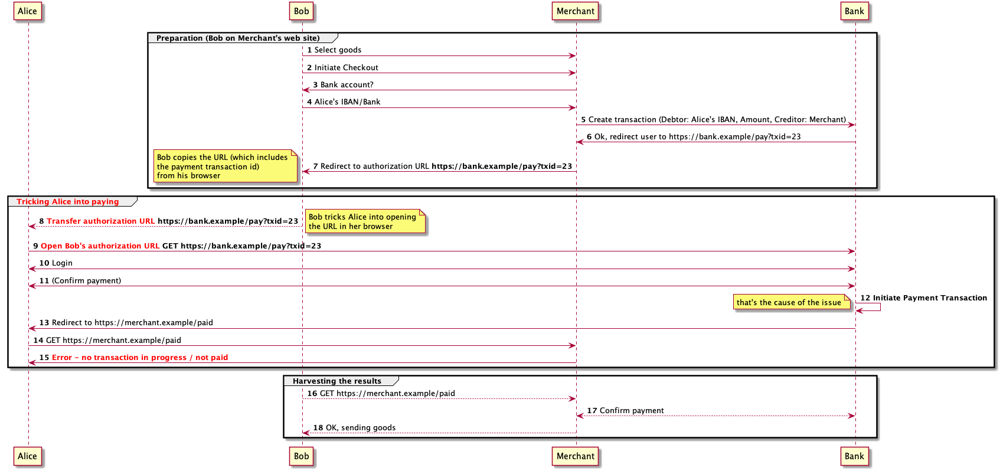
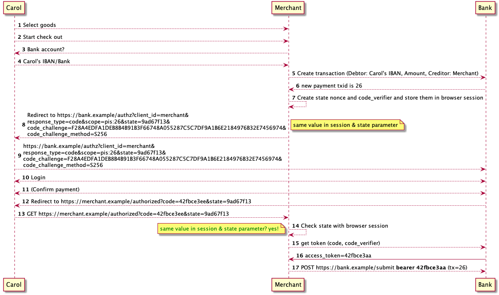
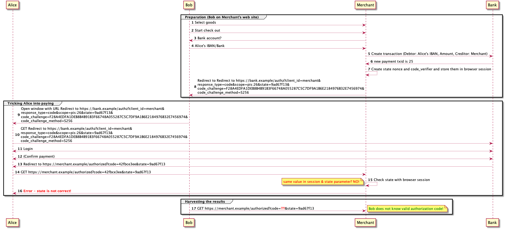
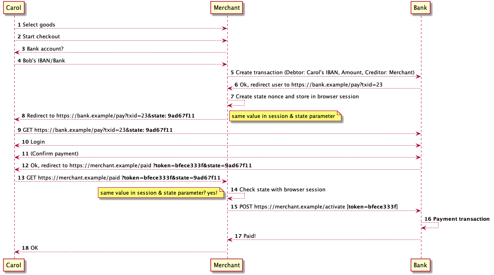
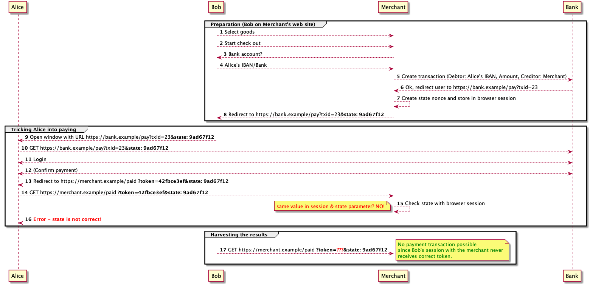

<header style="color:#000000;font-weight:400;text-decoration:none;vertical-align:baseline;font-size:26pt;font-family:"Arial";font-style:normal">
Cross-Browser Payment Initiation Attack
</header>

Publication Date: 01.03.2019

[TOC]

# Introduction

This document is based on a security threat analysis of several PSD2 API
standards conducted by OpenID Foundation's Financial-grade API (FAPI)
Working Group (https://openid.net/wg/fapi/).

It describes a possible attack on payment flows utilizing a
browser-based redirect flow to authenticate the user and gather her
consent to initiate the payment.

Idea: Bob (B) wants to make Alice (A) pay for the goods he ordered at
the web site of some merchant (M).

# Vulnerable API Designs

Payment flows that follow the following basic scheme are vulnerable to
the attack:

1.  The merchant is a PSD2 TPP and offers PSD2 Payment Initiation as
    payment method.
2.  For payment, the user is redirected from the merchant to her bank.
3.  The URL to which she is redirected designates (directly or
    indirectly, e.g., by referring to a payment resource) the intended
    receiver of the payment, the amount and currency to be transferred,
    and the purpose/reference of the payment.
4.  At this URL, the user is prompted to authenticate to the bank and
    provide her consent to the transaction.
5.  The actual transfer of funds is performed in the same step before
    redirecting the user agent back to the merchant.

As can be seen from the attack below, **the fact that the transfer of
funds is performed before redirecting the user agent back to the
merchant is what makes the API design vulnerable**: There is no check that
the flow was started in the same user agent in which the authentication
and payment were performed.

## Prerequisites

1.  Alice needs to be expecting some kind of payment flow, for example,
    because she is shopping for some goods.
2.  Bob needs to know **when** Alice expects to do this payment. It
    suffices if Bob learns when Alice opens the payment page at the
    merchant or the authentication URI of the bank. There are several
    possibilities how Bob can achieve this:

    a.  Bob controls advertisement or tracking scripts in the merchant's
        web site. (Note: Even if these are **sandboxed in an iframe**,
        these kinds of scripts often learn the visited URL since this
        is important for tracking.)

    b.  Bob might be able to use leaked information from the merchant
        web site, for example via CSRF or inadvertently exposed state
        information.

    c.  If Bob can read the network traffic, he can, even if the traffic
        is protected by TLS, often read the domain of the visited web
        site (SNI header) or correlate IP addresses and packet sizes
        with the visited web site.

3.  Bob needs to be able to open a URL chosen by him in Alice's browser.
    There are many different mechanisms through which Bob can achieve
    this and is hard to foresee which ones would be used in a real
    attack. Some options are: Alice visits Bob's website, Bob controls
    an advertisement script, or Bob sends an email to Alice.
4.  Depending on the details of the payment interface, Bob might need to
    know some information about Alice; for example, the bank (to start
    the payment with the correct bank) or the IBAN of Alice's account
    (if the IBAN is required for starting the payment flow). If needed,
    he might learn this from social engineering, data leakage on a web
    site, etc.

# The Attack

## Preparation (Bob on Merchant's web site)

**Message \# 1** Bob selects a product at a merchant web site.

**Message \# 2** Bob initiates the checkout.

**Message \# 3** The merchant asks Bob for his bank account.

**Message \# 4** Bob enters Alice's Bank Id or IBAN.

**Messages \# 5 & \# 6** The merchant sets up a new payment initiation
transaction with the Merchant's IBAN as the creditor account and the
price of the shopping cart as amount. Depending on the API design, it
might be required to set Alice's IBAN as the debtor

The bank responds with an URL the merchant needs to redirect the user's
browser to in order to authenticate and authorize the payment (payment
authorization URL).

**Message \# 7** The merchant redirects the browser to the bank. Bob
copies the URL (which includes data identifying the payment initiation
transaction).

## Tricking Alice into paying

**Message \# 8 & \# 9** Bob tricks Alice into opening this URL in her
browser (see [Prerequisites](#prerequisites)).

**Message \# 10** Alice logs into her bank.

**Message \# 11** Alice confirms the payment initiation using a SCA (SCA
is potentially omitted if the merchant is on the exemption list or the
amount is below a certain limit).

**Message \# 12** The bank initiates the payment.

**Message \# 13 & \# 14** The bank redirects the browser back to the
merchant's after pay landing page (in Alice's browser)

**Message \# 15** The merchant site does not know anything about an
ongoing checkout since there are no cookies in Alice's browser. It shows
an error. Alice is confused.

Note: Depending on the exact method chosen to open the window, Bob
    might be able to close the window of Alice's browser in which the
    merchant website would be opened, e.g., because Bob controls the
    top-level window.

## Harvesting the results

**Message \# 16** Bob waited for some time and then directs his browser
to the merchant's after pay landing page (in his browser).

**Message \# 17** The merchant recognizes the checkout (based on the
browser cookies), queries the status of the payment with the bank and
confirms the successful payment to Bob.

**Message \# 18** The merchant delivers the goods to Bob.

Note: Bob might repeat the steps listed here in order to get a precise
    timing for closing that window.

# The Vulnerability in Detail

The reasons for this vulnerability are

-   the **lack of binding between the browser** which **initiated
    payment transaction** (Bob's browser) and the **browser where the
    transaction was authorized** (Alice's browser) and
-   the fact **the transaction is automatically initiated** when the
    user authorized it (Message \#12) before such a lack of binding
    could be detected.

This allows the attacker to prepare a transaction and remotely trick the
victim into executing it. Since the attacker has all the details, it can
benefit from the successful execution. That's why this kind of attack is
typically referred to as ["session fixation"](https://en.wikipedia.org/wiki/Session\_fixation).

**The Strong Customer Authentication (SCA)/Dynamic Linking is the only
line of defense in the design described above.** This means it's Alice's
responsibility to recognize the attack and stop it by refusing to
perform the respective SCA. Since the attacker will most likely
synchronize his attack with a payment process Alice is expecting makes
it even harder.

Note: Neither the TPP nor the ASPSP will directly know Alice refused to
    perform SCA because it recognized an attempt to attack her, which
    means it's very hard to chase and stop the attacker effectively.

The situation is getting even worse, if the particular transaction is
subject to an exemption, e.g. because Alice whitelisted the respective
merchant. In this case even the SCA line of the defense disappears
leaving Alice unprotected.

As a result, the design described above puts a huge burden on the
shoulders of the average PSU while there exist ways to mitigate this
kind of attack on the protocol level without the need to rely on the
user as shown in the following section.

Note: This attack would also work for account information services. In
    this case, the attacker sets up a transaction (or consent request),
    which is then upgraded (authorized) by the victim. The attacker then
    (through the TPP) just uses the handle to the transaction (or
    consent resource) to access the account information.

# Mitigation using OAuth 2.0

The attack can be mitigated by generating and issuing a dynamically generated code (a nonce) in the browser-based authorization process which is required to complete the transaction. Since the attacker does not control Alice’s device, he is unable to get access to this code. Moreover, a check to verify the transaction’s binding to the particular browser is required.

This mitigation **and mitigations against many other attacks[^2]** are already contained in the authorization code grant type defined by the [OAuth 2.0 authorization framework](https://tools.ietf.org/html/rfc6749#section-4.1).

Using OAuth 2.0 for the payment flows enables merchants and banks to use existing, “battle-proven” implementations and frameworks (see [https://oauth.net/code/](https://oauth.net/code/)) and to avoid implementation errors. Moreover, the security of the OAuth protocol has been analyzed by security researchers in detail.

Introducing OAuth 2.0 and the respective counter measures to the payment flow means: 

* The bank does **not initiate the payment during the authorization process**.
* The authorization process sends the browser back to the merchant site and the redirect includes a freshly generated code associated with the current transaction.
* The merchant exchanges this code for an access token and uses it to initiate the payment using an API call exposed by the bank. 
* This gives the merchant and the bank a chance to detect whether the transaction was relocated to a different device before the payment is actually initiated.

**Before** the merchant triggers the payment initiation, it **must** check whether the authorization response it just received belongs to an authorization request that was sent from the current browser (**browser binding!**). 

The merchant therefore adds a nonce in the “state” parameter to the authorization request and binds it to the user’s browser session. In the redirection back, the “state” parameter value is added again by the bank. The merchant then checks that the “state” parameter value matches the state value stored in the cookie.

## Modified Payment Flow (good case)

The payment initiation flow using OAuth 2.0 is shown in the following
sequence diagram.

Note: This flow applies all recommendations given for securing redirect based flow in the [OAuth 2.0 Security Best Current Practice](https://tools.ietf.org/html/draft-ietf-oauth-security-topics), i.e. it goes beyond just protecting against the security issue discussed in this document. 

In order to make the flow OAuth compliant, the authorization request and response (messages #8 & #13) are modified to use OAuth standard parameters. 
Note: The payment transaction id is encoded in the OAuth standard authorization request parameter “scope”.

Beside the changes required to make the flow OAuth 2.0 compliant, there are three important additions:

**(1) Browser Binding (CSRF protection)**
In messages \# 7 & \# 8 the merchant establishes a nonce that is stored in the browser session and sent to the bank (in the OAuth parameter “state”), which links this transaction to the particular browser session. In message \# 14, the merchant compares the state values in the session to the value of the state response parameter. Since it is the same value, this transaction was initiated in the same browser and the process can continue. 

**(2) Access Token for Payment Initiation**
After this check (which only can take place at the merchant!), the merchant exchanges the OAuth code for an access token, which is used to initiate the payment. The code exchange request is authenticated using the credentials the merchant had set up with the bank (e.g. TLS Client Authentication using X.509 certificates). Only after checking the authorization code and its binding to the merchant’s client_id, the bank sends the access token to the merchant in the response (message \# 16). 

**(3) Code Replay/Injection Prevention**
In messages \# 7 & \# 8, the merchant establishes a nonce (the "code\_verifier") that is stored in the browser session and sends the SHA256 of this parameter in the OAuth parameter “code\_challenge” to the authorization server. In message \# 15, the merchant sends the "code\_verifier" along with the code to the authorization server. The authorization server compares the SHA-256 fingerprint of this parameter with the "code\_challange" initially sent with the authorization transaction in order to detect code replay attempts.

##Modified Payment Flow (Attack)

The following sequence diagram shows how the attack is prevented in the adapted protocol design.

If Bob forwards the authorization URL to Alice, as in the attack above, then Alice would be redirected and the code would be received by the merchant but it will be received in Alice’s session with the merchant. At this point, **the CSRF protection in step \# 15 by the merchant will detect and prevent the attack**. The merchant will therefore not start the payment activation. 

Moreover, **Bob is unable to utilize the results of Alice's payment authorization** because he does not know the authorization code provided in \# 13 to the merchant in Alice's session. Without the authorization code, Bob cannot simulate the authorization response from the bank which is the pre-requisite for utilizing the payment initiation authorized by Alice to his benefit. 

#Summary

The solution proposed in this document is compatible to existing implementations of OAuth 2.0. It establishes multiple layers of defense against the "Cross-Browser Payment Initation Attack" as well as other attacks. The [OAuth 2.0 Security Best Practice, Section 2.1](https://tools.ietf.org/html/draft-ietf-oauth-security-topics-10#section-2.1) gives the the full set of recommendations how to protect Redirect-Based
Flows using OAuth 2.0. 

In addition the OpenID Foundation has published a [financial-grade
security profile of OAuth 2.0](https://openid.net/wg/fapi/) which
includes these best practices and additional security mechanisms.

# Acknowledgement

The following people contributed to this document:  
  
Nat Sakimura (Nomura Research Institute) -- Chair  
Dave Tonge (Moneyhub) -- Co-chair, UK Implementation Entity Liaison  
Brian Campbell (Ping Identity)

# Authors' Addresses

Dr. Torsten Lodderstedt

yes.com AG  
Email: torsten@yes.com  
URI: http://www.yes.com/  
  
Dr. Daniel Fett  
yes.com AG  
Email: danielf@yes.com  
URI: http://www.yes.com/

# Appendix A: Mitigation (General Approach)

The attack can be mitigated by generating and issuing a token in the
browser-based authorization process, which is required to complete the
transaction. Since the attacker does not control Alice's device, he is
unable to get access to this token. Moreover, a check to verify the
transaction's binding to the particular browser is introduced.

Applying this pattern to the payment flow means:

-   The bank does not initiate the payment in the authorization process.
-   The authorization process sends the browser back to the merchant
    site and the redirect includes a freshly generated token associated
    with the current transaction.
-   The merchant uses this token to activate the payment initiation
    using an API call exposed by the bank.

BEFORE the merchant triggers the payment initiation, it MUST check
whether the authorization response it just received belongs to an
authorization request that was sent from the current browser (BROWSER
BINDING!).

The solutions to implement this binding are protocol specific. In OAuth
2.0, for example, the merchant would add a nonce as the
[state](https://tools.ietf.org/html/rfc6749#section-4.1.1) parameter
to the authorization request and bind it to the user's browser session.
In the redirection back, the same parameter is added again by the bank.
The merchant could then check that the state parameter matches the state
value stored in the cookie.

### Modified Payment Flow (good case)

The following sequence diagram shows the modified payment flow in a good
case (no attack is performed):

There are two important additions:

**(1) Browser Binding**

In messages \# 7 & \# 8 the merchant establishes a nonce that is stored in
the browser session and sent to the bank, which links this transaction
to the particular browser session.

In message \# 14, the merchant compares the state values in the session
to the value of the state response parameter. Since it is the same
value, this transaction was initiated in the same browser and the
process can continue.

**(2) Token for Payment Initiation**

After this check (which only can take place at the merchant!), the
merchant now uses the token issued by the bank to initiate the payment.

### Modified Payment Flow (Attack)

The following diagram shows how an attempt by Bob to trick Alice into
paying his goods is detected and prevented.

If Bob forwards the authorization URL to Alice, as in the attack above,
then Alice would be redirected and the token would be received by the
merchant but it **will be received in Alice's session with the
merchant**. At this point, the CSRF protection by the merchant will
detect and prevent the attack. The merchant will therefore not start the
payment activation.

Bob will not be able to forward Alice's session to the merchant since he
does not see the token. Bob will not be able to activate his payment
using Alice's account.

Note: The security of this solution depends on the secrecy of the token.
For example, if the URL containing the token leaks to the attacker, the
mechanism does not provide additional security. Such a leakage can
happen, for example, through referrer headers set by the browser, the
browser history, log files of browsers, proxy servers, and operating
systems, and, on mobile operating systems, during communication between
apps.
    
[^2]: see https://tools.ietf.org/html/draft-ietf-oauth-security-topics
